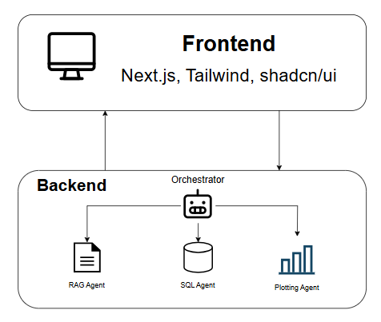

Here’s the English version of your shortened README:

---

# SQL-RAG System

A **multi-agent AI system** combining **SQL generation**, **document retrieval (RAG)**, and **data visualization**.
Built with **LangGraph + LangChain** on the backend and **Next.js + Tailwind** on the frontend, enabling **natural language data querying** and **automatic chart generation**.


## Setup 

### **1. Clone Repository**
```bash
git clone https://github.com/kuongan/sql-rag-system.git
cd sql-rag-system
```

### **2. Environment Setup**
Create `.env` file in backend directory:
```bash
GOOGLE_API_KEY=your_primary_key
GOOGLE_API_KEY_1=your_secondary_key
# Add more keys for load balancing
DATABASE_URL=your_url
# LangSmith Configuration (optional)
LANGSMITH_API_KEY=your_langsmith_key
LANGSMITH_PROJECT=name_project
LANGSMITH_ENDPOINT=https://api.smith.langchain.com
LANGSMITH_TRACING=true
# Vector Store Configuration
FAISS_STORE_PATH=./data/faiss_store
```

### **3. Start Services**
```bash
# Build and run in background
docker-compose up -d --build
```

### **4. Access Application**
- **Frontend**: http://localhost:3000
- **Backend API**: http://localhost:8000
- **API Documentation**: http://localhost:8000/docs


## 🏗️ System Architecture

---

## 🎯 Key Features

* **SQL Agent** 🗃️: Natural language → SQL, multi-table joins, safe `SELECT` only.
* **RAG Agent** 📚: FAISS-based semantic search, answers from docs/PDFs.
* **Plotting Agent** 📊: Automatically generates bar/line/pie charts from data.
* **Orchestrator (ReAct)** 🤖: Intent detection, agent coordination, context management.

---

## 🔧 Tech Stack

### **Backend**

* **FastAPI** – High-performance REST API
* **LangGraph / LangChain** – Multi-agent orchestration
* **Google Gemini** – LLM integration
* **FAISS** – Vector search (RAG)
* **SQLite** – Demo database
* **Pydantic** – Data validation

### **Frontend**

* **Next.js 15** – React framework
* **TypeScript** – Type-safe development
* **Tailwind CSS v4** – Utility-first styling
* **shadcn/ui** – Component library
* **React Hooks** – State management
